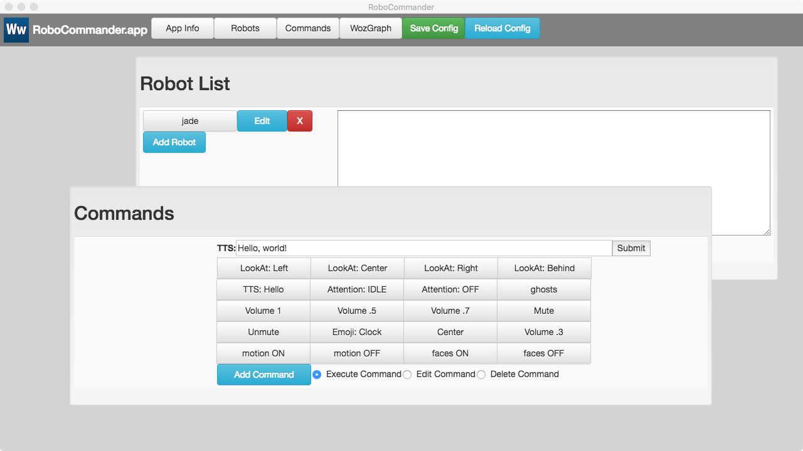
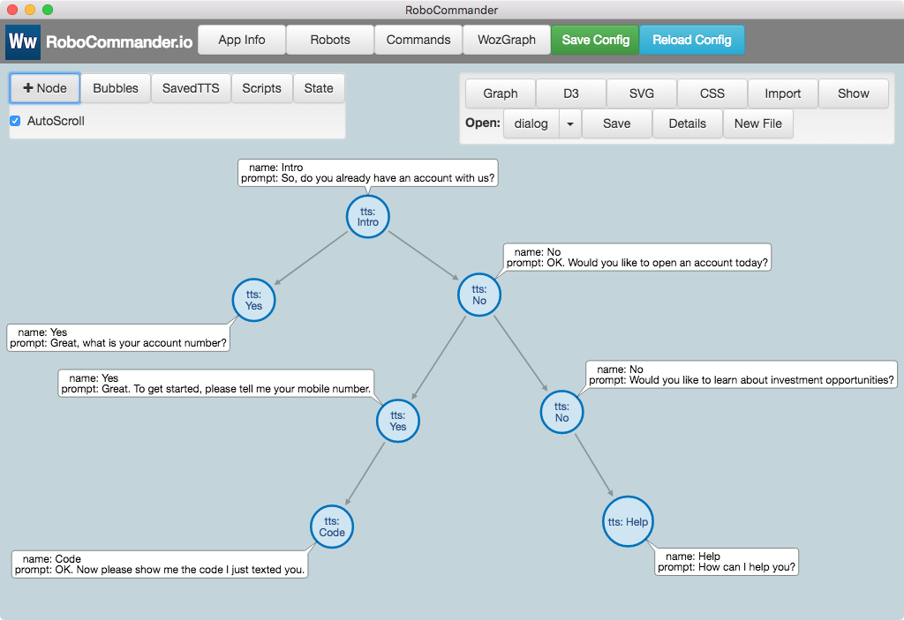

## robocommander

  

[https://wwlib.github.io/robocommander/](https://wwlib.github.io/robocommander/)

[https://wwlib.github.io](https://wwlib.github.io/)

robocommander is a tool for controlling robots. Any robot that implements a command protocol via a socket or REST API can potentially be controlled by robocommander (with appropriate modifications). The current version can control [Jibo](https://jibo.com/) robots (dev credentials are required).

robocommander is ideal for real-time, human-operated Woz (Wizard of Oz) remote control. In addition, robocommander’s WozGraph panel provides a graph-based tool for designing and controlling scripted interactions. WozGraph layouts can incorporate simple automation using  JavaScript. WozGraph layouts can be configured to respond automatically to voice commands via integration with LUIS and/or Dialogflow NLU services.

For developers, robocommander includes TypeScript classes that provide an easy way to prototype NLU-driven Remote Operation Mode (ROM) skills.

### Docs

[https://wwlib.github.io/robocommander/robo-commander-intro.html](https://wwlib.github.io/robocommander/robo-commander-intro.html)

### Overview

Overview video (YouTube): [https://www.youtube.com/embed/rYSjbH23u9g](https://www.youtube.com/embed/rYSjbH23u9g)


### Getting Started

Building robocommander requires node v8.11.2 (or newer)

The use of the [yarn](https://yarnpkg.com/) package manager is **strongly** recommended, as opposed to using `npm`.

```bash
yarn
```

### Development Scripts

```bash
# run application in development mode
yarn dev

# compile source code and create webpack output
yarn compile

# `yarn compile` & create build with electron-builder
yarn dist

# `yarn compile` & create unpacked build with electron-builder
yarn dist:dir
```






### Linux setup
* Recommend NodeJS 8.11.1
* Install the latest yarn package globally via npm
* $ yarn
* $ yarn compile
* $ yarn dev

If things go wrong, try clearing any existing node_modules directory
Also clear yarn cache: $ rm -rf ~/.cache/yarn

### License

[MIT](https://github.com/electron/electron/blob/master/LICENSE)
