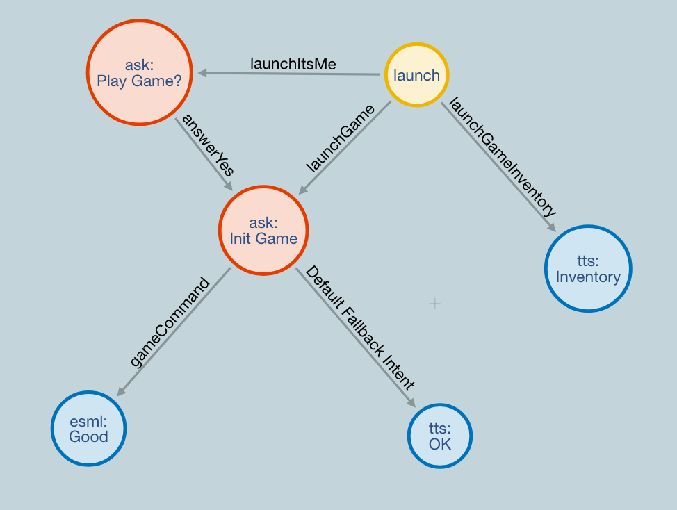
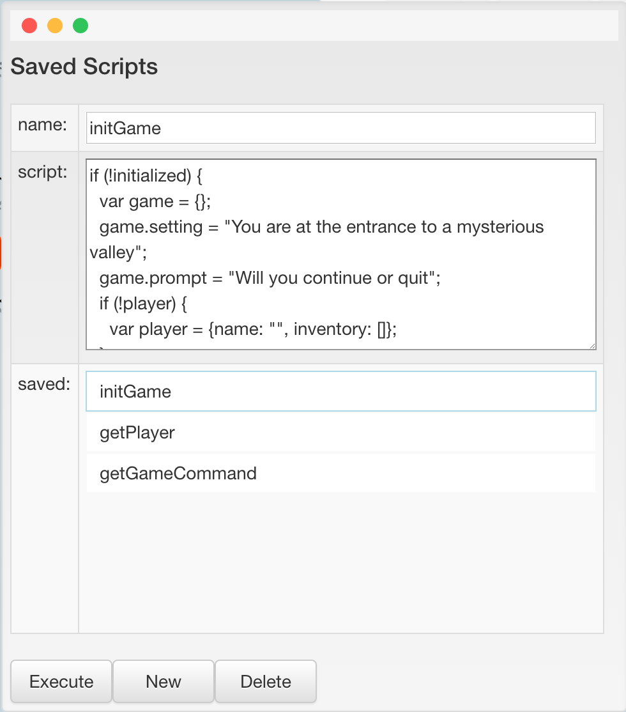
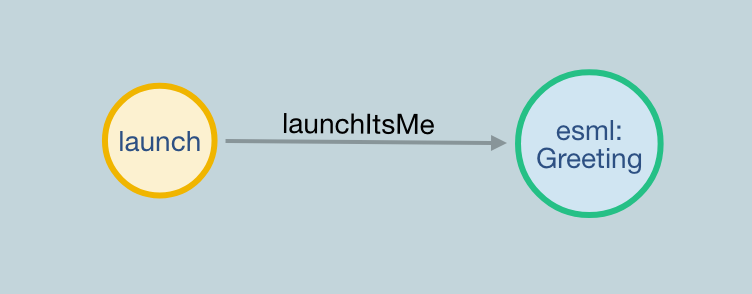
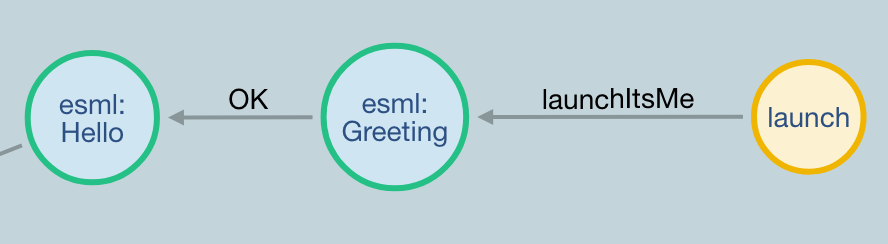
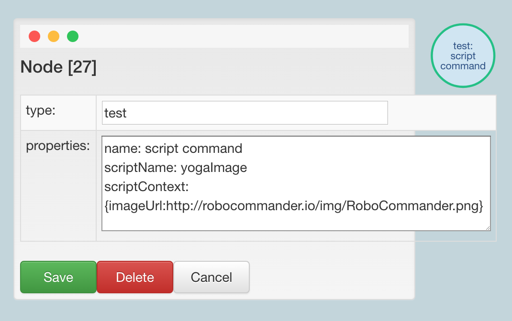

### WozGraph


#### ask nodes (prompts)
- avoid using question marks (*?*). They confuse the ESML engine and trigger random animations.
- when using an ask node, Jibo (the robot) will render the given prompt via TTS and then use cloud NLU to process the spoken answer (the user's utterance). If the NLU results contain a valid *intent*, outgoing links from the ask node will be analyzed. If an outgoing link is labeled with the NLU intent (i.e. *launchItsMe*) the node pointed to by that link will be executed automatically. For example:

node(type:ask, name: Init Game) -[gameCommand]-> node(type:esml, name: Good)



node(type:ask, name: Init Game)
```
name: Init
scriptName: initGame
prompt: OK. Let's get started ${player.name}, ${game.setting}, ${game.prompt}
context: gameCommands
```

- Note: the *context* property is passed to dialogflow (google NLU). In this case, the *gameCommands* context lets dialogflow know that the utterance's intent should be a game command. The NLU *entity* will indicate which command was uttered (i.e. *continue* or *quit*).
- If the resulting NLU intent is *gameCommand* the next node will be executed automatically.

#### scripts

- scripts are authored in the `Scripts` panel
- nodes can have a *scriptName* property that can contain the name of a script to run when the node is executed
- node scripts are executed before any other properties are evaluated
  - [GraphEditor: executeNode()](../src/renderer/components/grapheditor/GraphEditor.tsx)
  - [GraphModel: executeScriptWithName(scriptName: string, robot?: Robot): any](../src/renderer/components/grapheditor/model/GraphModel.ts)
  - [GraphModel: executeScript(activeScript: SavedScript, robot?: Robot, data?: any): any](../src/renderer/components/grapheditor/model/GraphModel.ts)
  - [GraphModel: evaluateScriptWithData(scriptText: string, scriptData: any): string](../src/renderer/components/grapheditor/model/GraphModel.ts)
  - [GraphModel: getSandbox(promptData:any): any](../src/renderer/components/grapheditor/model/GraphModel.ts)
  - [ScriptConfig](../src/renderer/components/grapheditor/model/ScriptConfig.ts)
- scripts are evaluated in the context of a sandbox object which is derived either from:
  - the active robot's stateData (*robot.stateData*)
  - a global state object (*this._globalStateData*) if there is no active robot.
  - the node's scriptContext property - if provided
  - Note: *\_globalStateData* is used for testing and developing without a connected robot.
- Note: *GraphModel.activeRobot* is set when a valid intent is received from a robot (*GraphEditor:onRobotIntent(robotIntent: RobotIntent): void*)


From GraphEditor: executeNode - handling of the scriptContext property
```js

/** script execution **/
// if the node has a valid scriptName property, execute that script
// if the node has a valid scriptContext property, execute the script using that data as context
// otherwise execute the script using the active robot's stateData as context ()
let scriptName: string = node.properties.has('scriptName');
let scriptContext: any = node.properties.has('scriptContext');
let scriptData: any;
if (scriptContext) {
    try {
        scriptData = jsonic(scriptContext);
    } catch (err) {
        console.log(`GraphEditor: executeNode: error: `, err);
    }
}

```

```js
executeScriptWithName(scriptName: string, robot?: Robot): any {
    let result: any = undefined;
    if (this.activeGraph) {
        let scriptConfig: ScriptConfig = this.activeGraph.scriptConfig;
        console.log(`GraphModel: executeScriptWithName: scriptConfig:`, scriptConfig);
        let savedScript: SavedScript | undefined = scriptConfig.getSavedScriptWithName(scriptName);
        if (savedScript) {
            result = this.executeScript(savedScript, robot);
        } else {
            console.log(`executeScriptWithName: error: no script found with name: ${scriptName}`);
        }
    }
    return result;
}
```

```js
executeScript(activeScript: SavedScript, robot?: Robot, data?: any): any {
    console.log(`GraphModel: executeScript:`, activeScript, robot, data);
    let output: any = undefined;
    if (robot) {
        output = this.evaluateScriptWithData(activeScript.script, robot.stateData);
    } else {
        if (!data) {
            data = this._globalStateData;
        }
        output = this.evaluateScriptWithData(activeScript.script, data);
    }
    console.log(`GraphModel: executeScript: output:`, output);
    return output;
}
```

```js
evaluateScriptWithData(scriptText: string, scriptData: any): string {
    let scriptDataSandbox:any;
    scriptDataSandbox = this.getSandbox(scriptData);
    try { //do a safe eval on the condition
        return vm.runInContext(scriptText, scriptDataSandbox);
    } catch (e) {
        console.log(`evaluateScriptWithData: error evaluating: ${scriptText}: ${scriptData} - error: ${e.message}`);
        return '';
    }
}
```

```js
getSandbox(promptData:any): any {
    return vm.createContext(promptData);
}
```


#### script examples



```
name: initGame
script:
if (!initialized) {
  var game = {};
  game.setting = "You are at the entrance to a mysterious valley";
  game.prompt = "Will you continue or quit";
  if (!player) {
    var player = {name: "", inventory: []};
  }
  var initialized = true;
}
```

```
name: getPlayer
script:
if (!player) {
  var player = {name: "", inventory: []};
}
if (user && user != "Someone") {
  player.name = user;
}
```

```
name: getGameCommand
script:
if (gameCommand) {
  game.command = gameCommand;
} else {
  game.command = "";
}
```

usage

node(type:launch) -[launchItsMe]-> node(type: esml, name: Greeting)



node(type: esml, name: Greeting)
```
name: Greeting
scriptName: getPlayer
prompt: Hi ${player.name}. Would you like to play a game
```


#### robotCommand scripts
```js
if (!robotCommand) {
  var robotCommand = {type: "", data: {}};
}
if (!imageUrl) {
  var imageUrl = "http://cookstreetvillageactivitycentre.com/wp-content/uploads/2017/12/Morning-Yoga.jpg";
}
robotCommand = {type:"image", data:{ name:"image",url:imageUrl}}
```

```js
if (!robotCommand) {
  var robotCommand = {type: "", data: {}};
}
robotCommand = {type:"eye", data:{}}
```

#### ESML nodes - special OK 'intent'



When TTS/ESML nodes have an outgoing OK intent, the connected node is automatically exeuted.
```
name: Greeting
scriptName: getPlayer
prompt: Hi ${player.name}. It's nice to see you.
```

#### scriptContext example




Note: when executed, the script uses the scriptContext and returns a context with robotCommand defined as `{type:"image", data:{ name:"image",url:imageUrl}}`. So, robotCommand gets sent to the robot.

```
name: script command
scriptName: yogaImage
scriptContext: {imageUrl:http://robocommander.io/img/RoboCommander.png}
```

yogaImage script
```js
if (!robotCommand) {
  var robotCommand = {type: "", data: {}};
}
if (!imageUrl) {
  var imageUrl = "http://cookstreetvillageactivitycentre.com/wp-content/uploads/2017/12/Morning-Yoga.jpg";
}
robotCommand = {type:"image", data:{ name:"image",url:imageUrl}}
```
